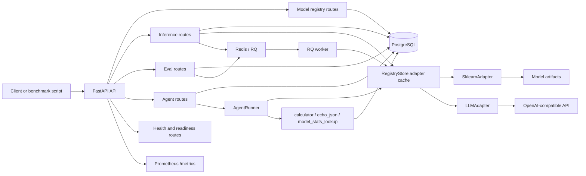

# AtlasML

AtlasML is a lightweight ML/LLM serving, evaluation, and agent workflow backend. It demonstrates common AI infrastructure patterns: model versioning, artifact validation, synchronous and asynchronous inference, evaluation tracking, LLM token accounting, agent run tracing, and operational observability.

## Quick Start

```bash
# Start Postgres, Redis, API, and worker services
docker compose up -d

# Run database migrations
docker compose exec api alembic upgrade head

# Run the demo
python demo.py
```

If `API_KEY` is set, protected endpoints require the `X-API-Key` header. The example environment uses:

```bash
X-API-Key: dev-secret-key
```

## Running Tests

```bash
pip install -r requirements.txt aiosqlite
pytest tests/ -v
```

Edge benchmark dependencies are kept separate:

```bash
pip install -r requirements-edge.txt
```

## Architecture

- **FastAPI API server** exposes registry, inference, eval, health, and agent routes.
- **PostgreSQL + SQLAlchemy 2.x** store model metadata, inference logs, eval results, jobs, deployment events, and agent traces.
- **Redis + RQ** run asynchronous prediction and eval jobs outside the HTTP request path.
- **Model Registry** validates artifacts, tracks versions, activates and rolls back deployments, and resolves adapters.
- **Adapter Layer** serves sklearn/joblib models and OpenAI-compatible LLM models through a shared `ModelAdapter` interface.
- **Agent Runner** executes a minimal tool-calling loop with trace persistence for runs, steps, and tool invocations.
- **Observability** includes `/health`, `/ready`, `/metrics`, model stats, agent stats, structured JSON logs, request IDs, latency, errors, schema validity, and LLM token usage.

Detailed diagrams live in [docs/architecture_diagram.md](docs/architecture_diagram.md), and the source map lives in [docs/code_map.md](docs/code_map.md).



## API Overview

| Endpoint | Purpose | API key when configured |
|---|---|---|
| `GET /health` | API liveness check | No |
| `GET /ready` | Postgres and Redis readiness check | No |
| `GET /metrics` | Prometheus metrics | No |
| `POST /models/register` | Register a model version and validate local artifacts | Yes |
| `GET /models/{name}` | List versions for a model | No |
| `GET /models/{name}/active` | Get active version | No |
| `POST /models/{name}/activate` | Activate or roll back to a version and record a deployment event | Yes |
| `GET /models/{name}/deployments` | List deployment history | No |
| `GET /models/{name}/stats` | Summarize prediction latency, errors, and token usage | No |
| `POST /predict` | Run synchronous inference and write an inference log | Yes |
| `POST /jobs/predict` | Enqueue an asynchronous prediction job | Yes |
| `GET /jobs/{job_id}` | Read asynchronous job status and result | No |
| `POST /eval/run` | Enqueue an evaluation run | Yes |
| `GET /eval/runs/{run_id}` | Read eval run details and metrics | No |
| `GET /eval/compare` | Compare latest completed eval metrics between versions | No |
| `POST /agents/run` | Run a minimal tool-calling agent workflow | No |
| `GET /agents/runs/{run_id}` | Read an agent run summary | No |
| `GET /agents/runs/{run_id}/trace` | Read agent steps and tool invocations | No |
| `GET /agents/stats` | Summarize agent run success, duration, tokens, tools, and errors | No |

## Agent Workflows

AtlasML includes a minimal agent runner that asks an LLM-backed model to emit a JSON tool call, executes one built-in tool, and asks the model for a final answer. Each run persists:

- `AgentRun`: task, model, status, output, error, duration, and token counts
- `AgentStep`: LLM call, tool call, final answer, or error step details
- `ToolInvocation`: tool name, input, output, status, error, and latency

Built-in tools currently include:

- `calculator(expression)`
- `echo_json(payload)`
- `model_stats_lookup(model_name)`

## Error Contract

AtlasML uses explicit HTTP status codes for predictable client behavior, including `400` for invalid artifacts, `401` for invalid API keys, `404` for missing resources, and `409` for duplicate model versions. See [docs/api_errors.md](docs/api_errors.md) for details.

## Benchmarks and Evals

| Document | Script | Focus |
|---|---|---|
| [docs/benchmarks.md](docs/benchmarks.md) | `scripts/benchmark_api.py` | API latency for health, readiness, predict, enqueue, eval launch, and model stats |
| [docs/llm_benchmarks.md](docs/llm_benchmarks.md) | `scripts/benchmark_llm.py` | OpenAI-compatible LLM serving latency, schema validity, and token usage |
| [docs/edge_benchmark.md](docs/edge_benchmark.md) | `scripts/benchmark_edge.py` | PyTorch, quantization, TorchScript, and ONNX Runtime edge tradeoffs |
| [docs/agent_benchmarks.md](docs/agent_benchmarks.md) | `scripts/benchmark_agent.py` | End-to-end agent execution, trace persistence, latency, and tokens |
| [docs/agent_evals.md](docs/agent_evals.md) | `scripts/run_agent_eval.py` | Task-level agent success, tool accuracy, step count, latency, and tokens |

## Configuration

| Variable | Purpose |
|---|---|
| `DATABASE_URL` | Async SQLAlchemy URL for FastAPI |
| `DATABASE_SYNC_URL` | Sync SQLAlchemy URL for RQ workers |
| `REDIS_URL` | Redis connection URL |
| `API_KEY` | Optional API key for protected endpoints |
| `LOG_LEVEL` | Structured logging level |
| `DEFAULT_MODEL_TIMEOUT_MS` | Default model timeout setting |
| `OPENAI_API_BASE` | OpenAI-compatible chat completions base URL |
| `OPENAI_API_KEY` | API key for LLM adapters |

## Database Migrations

Alembic manages schema changes. The current schema includes model registry tables, eval tables, async job records, deployment events, inference logs with token fields, and agent trace tables.

```bash
docker compose exec api alembic upgrade head
```
