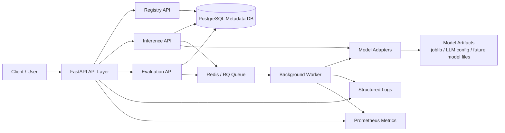
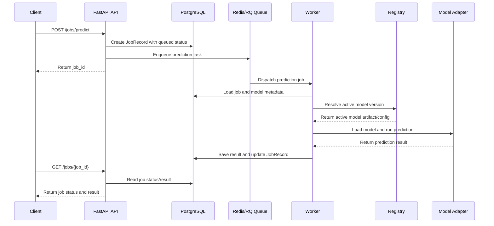

## Architecture

AtlasML is organized as a lightweight ML/LLM serving and evaluation platform. The API layer handles model registration, inference, and evaluation requests. PostgreSQL stores metadata and execution records, while Redis/RQ supports asynchronous background jobs.

## Async Prediction Workflow

The async prediction path is used when inference should be submitted as a background job instead of being executed immediately in the API request.

