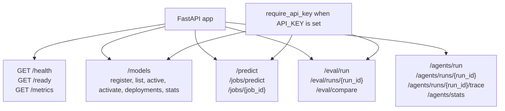
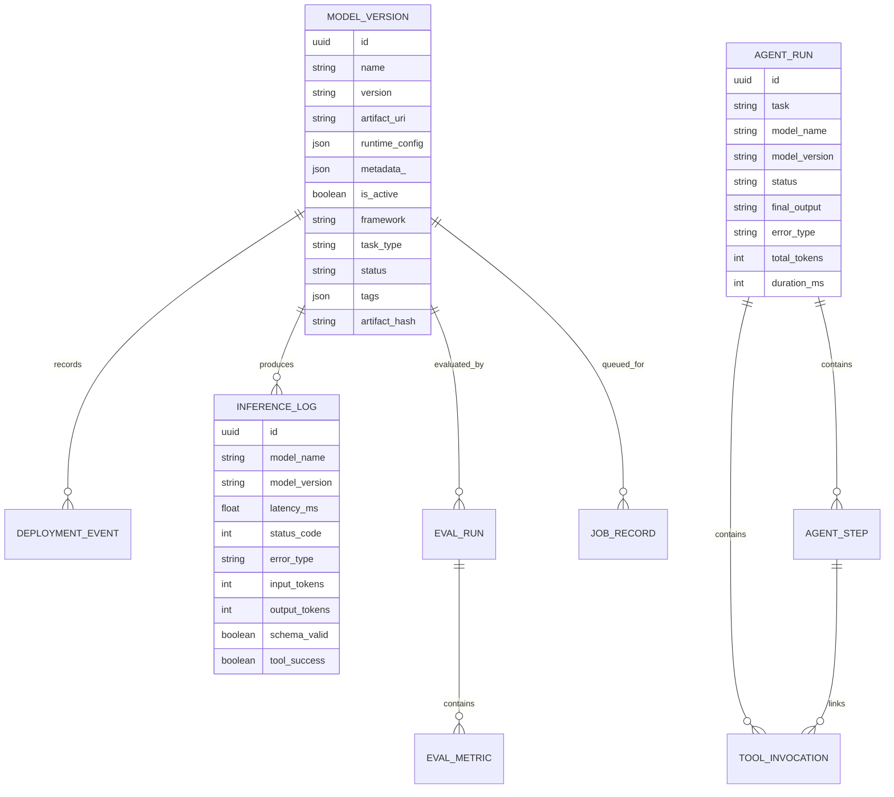
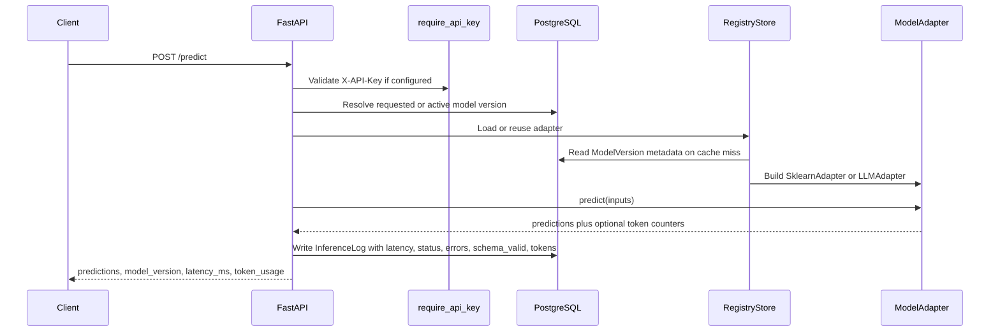
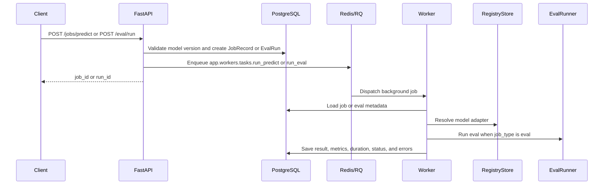
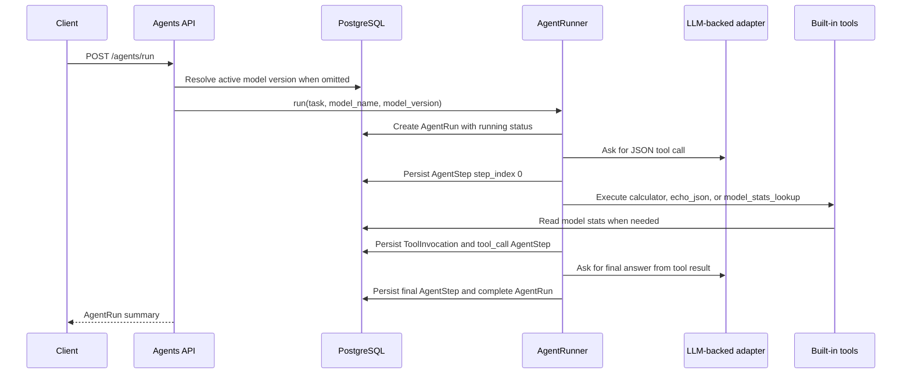
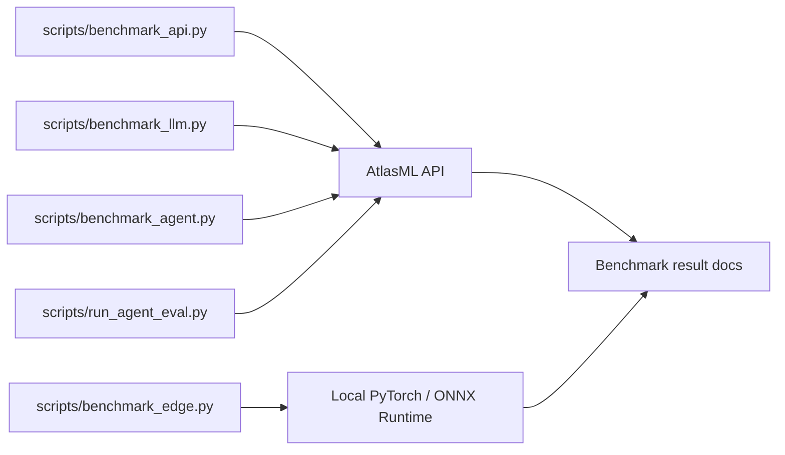

# AtlasML Architecture

AtlasML is organized as a compact AI infrastructure backend. The API layer accepts model registry, inference, evaluation, observability, and agent workflow requests. PostgreSQL stores metadata and execution records. Redis/RQ moves long-running prediction and eval work out of the request path. Model adapters isolate runtime-specific execution details for sklearn artifacts and OpenAI-compatible LLMs.

## System Overview

```mermaid
flowchart LR
    Client[Clients, demos, benchmarks] --> API[FastAPI application]

    subgraph Routes[API routers]
        Registry[app.api.registry]
        Inference[app.api.inference]
        Eval[app.api.eval]
        Agents[app.api.agents]
        Health[app.api.health]
    end

    API --> Routes

    Registry --> DB[(PostgreSQL)]
    Inference --> DB
    Eval --> DB
    Agents --> DB
    Health --> DB

    Inference --> Queue[Redis / RQ queue]
    Eval --> Queue
    Queue --> Worker[app.workers.tasks]

    Inference --> Store[RegistryStore]
    Worker --> Store
    Agents --> Runner[AgentRunner]
    Runner --> Store

    Store --> Sklearn[SklearnAdapter]
    Store --> LLM[LLMAdapter]
    Sklearn --> Artifacts[/app/artifacts and local files]
    LLM --> OpenAI[OpenAI-compatible chat completions API]

    Runner --> Tools[Built-in agent tools]
    Tools --> DB

    API --> Metrics[Prometheus /metrics]
    API --> Logs[structlog JSON logs with request_id]
    Worker --> Logs
```

## API Surface


```mermaid
flowchart TB
    API[FastAPI app]

    API --> H["GET /health<br/>GET /ready<br/>GET /metrics"]
    API --> M["/models<br/>register, list, active, activate, deployments, stats"]
    API --> P["/predict<br/>/jobs/predict<br/>/jobs/{job_id}"]
    API --> E["/eval/run<br/>/eval/runs/{run_id}<br/>/eval/compare"]
    API --> A["/agents/run<br/>/agents/runs/{run_id}<br/>/agents/runs/{run_id}/trace<br/>/agents/stats"]

    Auth[require_api_key when API_KEY is set] --> M
    Auth --> P
    Auth --> E
```

`require_api_key` is applied to registry mutation routes, prediction entry points, and eval launch. When `API_KEY` is unset, the dependency becomes a no-op for local development and tests.

## Persistence Model


```mermaid
erDiagram
    MODEL_VERSION ||--o{ DEPLOYMENT_EVENT : records
    MODEL_VERSION ||--o{ INFERENCE_LOG : produces
    MODEL_VERSION ||--o{ EVAL_RUN : evaluated_by
    EVAL_RUN ||--o{ EVAL_METRIC : contains
    MODEL_VERSION ||--o{ JOB_RECORD : queued_for
    AGENT_RUN ||--o{ AGENT_STEP : contains
    AGENT_RUN ||--o{ TOOL_INVOCATION : contains
    AGENT_STEP ||--o{ TOOL_INVOCATION : links

    MODEL_VERSION {
        uuid id
        string name
        string version
        string artifact_uri
        json runtime_config
        json metadata_
        boolean is_active
        string framework
        string task_type
        string status
        json tags
        string artifact_hash
    }

    INFERENCE_LOG {
        uuid id
        string model_name
        string model_version
        float latency_ms
        int status_code
        string error_type
        int input_tokens
        int output_tokens
        boolean schema_valid
        boolean tool_success
    }

    AGENT_RUN {
        uuid id
        string task
        string model_name
        string model_version
        string status
        string final_output
        string error_type
        int total_tokens
        int duration_ms
    }
```

The ORM definitions live in `app/db/models.py`. The agent trace migration is `alembic/versions/0c8a1adc90b4_add_agent_trace_tables.py`.

## Synchronous Prediction Workflow


```mermaid
sequenceDiagram
    participant C as Client
    participant API as FastAPI
    participant Auth as require_api_key
    participant DB as PostgreSQL
    participant Store as RegistryStore
    participant Adapter as ModelAdapter

    C->>API: POST /predict
    API->>Auth: Validate X-API-Key if configured
    API->>DB: Resolve requested or active model version
    API->>Store: Load or reuse adapter
    Store->>DB: Read ModelVersion metadata on cache miss
    Store->>Adapter: Build SklearnAdapter or LLMAdapter
    API->>Adapter: predict(inputs)
    Adapter-->>API: predictions plus optional token counters
    API->>DB: Write InferenceLog with latency, status, errors, schema_valid, tokens
    API-->>C: predictions, model_version, latency_ms, token_usage
```

## Async Prediction and Eval Workflow


```mermaid
sequenceDiagram
    participant C as Client
    participant API as FastAPI
    participant DB as PostgreSQL
    participant Q as Redis/RQ
    participant W as Worker
    participant Store as RegistryStore
    participant Runner as EvalRunner

    C->>API: POST /jobs/predict or POST /eval/run
    API->>DB: Validate model version and create JobRecord or EvalRun
    API->>Q: Enqueue app.workers.tasks.run_predict or run_eval
    API-->>C: job_id or run_id

    Q->>W: Dispatch background job
    W->>DB: Load job or eval metadata
    W->>Store: Resolve model adapter
    W->>Runner: Run eval when job_type is eval
    W->>DB: Save result, metrics, duration, status, and errors
```

## Agent Execution Workflow


```mermaid
sequenceDiagram
    participant C as Client
    participant API as Agents API
    participant DB as PostgreSQL
    participant R as AgentRunner
    participant LLM as LLM-backed adapter
    participant T as Built-in tools

    C->>API: POST /agents/run
    API->>DB: Resolve active model version when omitted
    API->>R: run(task, model_name, model_version)
    R->>DB: Create AgentRun with running status
    R->>LLM: Ask for JSON tool call
    R->>DB: Persist AgentStep step_index 0
    R->>T: Execute calculator, echo_json, or model_stats_lookup
    T->>DB: Read model stats when needed
    R->>DB: Persist ToolInvocation and tool_call AgentStep
    R->>LLM: Ask for final answer from tool result
    R->>DB: Persist final AgentStep and complete AgentRun
    API-->>C: AgentRun summary
```

Failed agent runs persist an error step and capture `error_type`, `error_message`, duration, and any available token counters. Trace inspection uses:

```text
GET /agents/runs/{run_id}/trace
```

## Observability

- `/health` returns API process liveness.
- `/ready` checks PostgreSQL with `SELECT 1` and Redis with `PING`.
- `/metrics` is exposed by `prometheus-fastapi-instrumentator`.
- Structured logs include per-request `request_id` via middleware.
- `InferenceLog` records prediction latency, HTTP status, error type, schema validity, and LLM token counters.
- `GET /models/{name}/stats` summarizes prediction volume, success and error counts, latency, token totals, and top error types.
- `GET /agents/stats` summarizes agent run volume, success rate, duration, token use, top tools, and top error types.

## Benchmark and Eval Entry Points


```mermaid
flowchart LR
    ApiBench[scripts/benchmark_api.py] --> API[AtlasML API]
    LLMBench[scripts/benchmark_llm.py] --> API
    AgentBench[scripts/benchmark_agent.py] --> API
    AgentEval[scripts/run_agent_eval.py] --> API
    EdgeBench[scripts/benchmark_edge.py] --> Local[Local PyTorch / ONNX Runtime]

    API --> Docs[Benchmark result docs]
    Local --> Docs
```

Benchmark and eval result writeups live in:

- `docs/benchmarks.md`
- `docs/llm_benchmarks.md`
- `docs/edge_benchmark.md`
- `docs/agent_benchmarks.md`
- `docs/agent_evals.md`
